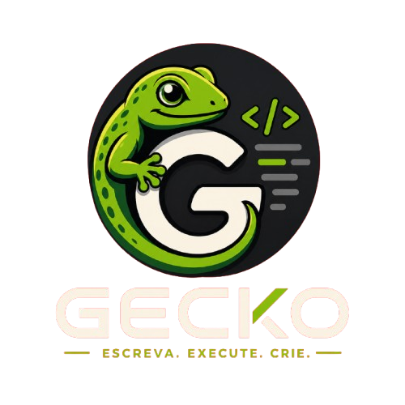

<div align="center">
	
	
**Uma linguagem moderna construída sobre a fundação do Go.**

[](https://github.com/)
[](https://go.dev/)
[](https://www.linux.org/)

</div>

---

## 🦎 Sobre

**Gecko** é uma linguagem de programação moderna baseada no ecossistema e na infraestrutura do Go, projetada para oferecer uma experiência de desenvolvimento mais simples, expressiva e produtiva, mantendo o desempenho e a confiabilidade de sua base.

O Gecko adiciona uma sintaxe mais amigável e recursos de alto nível à base do Go, permitindo desenvolver desde pequenos scripts e ferramentas de linha de comando até aplicações e sistemas de maior escala.

## ✨ Recursos

O Gecko inclui recursos próprios construídos sobre a base do Go:

- Sintaxe `.gk` para arquivos Gecko.
- Execução através de `gecko run`.
- `print` e `println` nativos.
- `input()` nativo para entrada de dados.
- Classes e herança.
- Sintaxe moderna para estruturas e valores.
- Modo dinâmico para uma experiência de programação mais simples.
- Modo tipado para maior controle sobre tipos e recursos avançados.
- Compatibilidade com o ecossistema de módulos do Go.
- Gerenciador de pacotes próprio através do `gpm`.
- Compilação para executáveis nativos.
- Ferramenta própria de formatação através do `fmt`.

## 🚀 Primeiros passos

### Olá, Gecko

Crie um arquivo `hello.gk`:

```go
println("Hello, Gecko!")
```

Execute com:

```bash
gecko run hello.gk
```

Para executar o projeto atual:

```bash
gecko run .
```

Compilar um executável

Para gerar um executável nativo:

```bash
gecko build
```

A separação entre run e build mantém a CLI simples e deixa claro se o objetivo é executar ou compilar.

## 📦 Gerenciador de pacotes

### O GPM (Gecko Package Manager) é o gerenciador de pacotes oficial do Gecko.

Ele fornece recursos para:

- Criar projetos Gecko.

- Instalar e remover dependências.

- Utilizar pacotes hospedados no GitHub.

- Utilizar pacotes compatíveis com o ecossistema Go.

- Gerenciar versões e dependências.

- Executar comandos definidos pelo projeto.

- Manter um arquivo de lock para builds reproduzíveis.


Criar um projeto

```bash
gpm init
```

Instalar uma dependência

```bash
gpm install github.com/example/package
```

Executar o projeto

```bash
gpm run start
```

## 🦎 Gecko e Go

O Gecko é construído a partir da base do Go e mantém compatibilidade com partes importantes do seu ecossistema, incluindo módulos, runtime e ferramentas.

Entretanto, o Gecko possui sua própria:

- Linguagem.

- Sintaxe.

- CLI.

- Ferramenta de formatação.

- Gerenciador de pacotes.

- Experiência de desenvolvimento.


O objetivo é aproveitar a fundação eficiente do Go enquanto oferece uma experiência de programação mais moderna e produtiva.

## 🛠️ Ferramentas

### O processo de build do Gecko gera as principais ferramentas do projeto:

```txt
bin/
├── gecko
├── fmt
└── gpm
```

## Gecko

CLI principal da linguagem:

```bash
gecko run main.gk
gecko build
gecko version
```

## fmt

Formatador oficial do código Gecko.

## Gpm

Gerenciador de pacotes oficial do Gecko.

## 📁 Estrutura

O código-fonte principal do Gecko está organizado sobre a base do compilador e runtime derivados do Go, juntamente com as extensões específicas da linguagem.

### Uma visão simplificada:

```txt
src/
├── cmd/
│   ├── compile/
│   └── gecko/
├── runtime/
└── ...
```

As extensões da linguagem são implementadas diretamente no compilador e runtime quando necessário.

## 🧪 Exemplos

Os exemplos da linguagem estão disponíveis em:

```txt
examples/
├── 00_hello.gk
└── ...
```

Exemplo utilizando entrada de dados:

```go
var name = input("Qual é o seu nome? ")
println("Olá, " + name + "!")
```

Execute:

```bash
gecko run examples/00_hello.gk
```

## 🤝 Contribuindo

Contribuições para o Gecko são bem-vindas.

Antes de contribuir, consulte as diretrizes de desenvolvimento do projeto.

Ao contribuir:

- Mantenha o código consistente com a arquitetura existente.

- Escreva código e comentários em inglês.

- Adicione testes para novos recursos.

- Atualize os exemplos quando uma nova funcionalidade da linguagem for introduzida.

- Verifique se o projeto continua compilando corretamente após alterações no compilador ou runtime.


## 📄 Licença

O Gecko é distribuído sob os termos definidos em [LICENSE](LICENSE).

---

<div align="center">
	Gecko — uma linguagem moderna construída sobre uma fundação rápida, confiável e eficiente.
</div>
